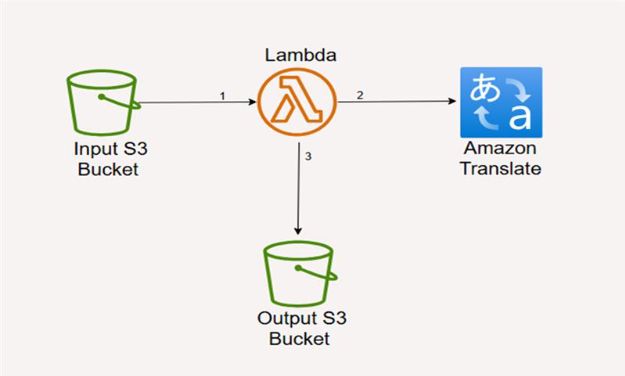
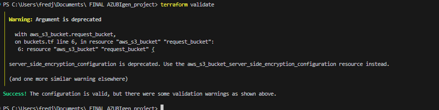
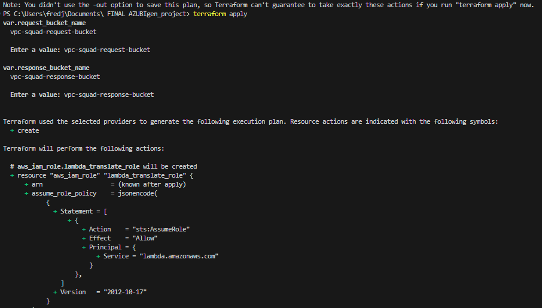
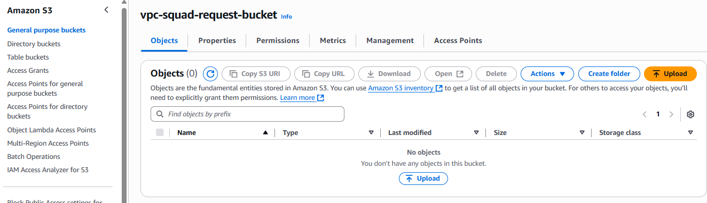
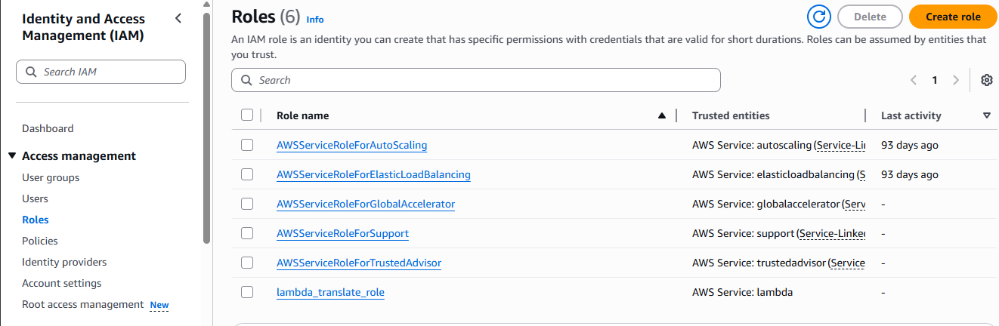
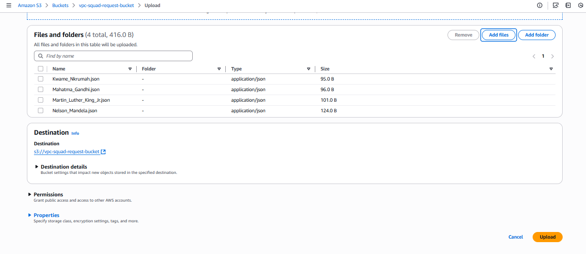
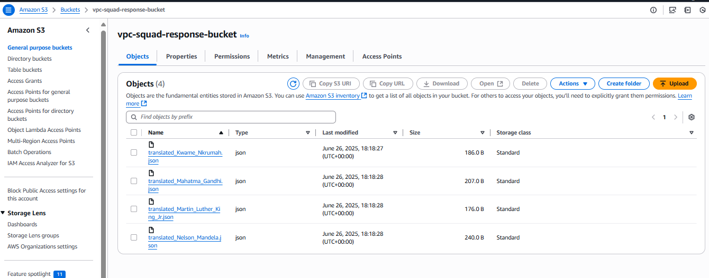

# AWS Translation Infrastructure - IaC Solution

A serverless Infrastructure-as-Code (IaC) solution built on AWS using Terraform, integrating AWS Translate for automated language translation and Amazon S3 for object storage. This project demonstrates a complete end-to-end translation pipeline using Python, Boto3, and AWS Lambda.

## 🏗️ Architecture Overview

This solution implements a fully serverless translation pipeline that:
- Automatically triggers translation when JSON files are uploaded to S3
- Processes translation requests using AWS Translate service
- Stores both input and translated output in separate S3 buckets
- Maintains security through proper IAM roles and policies

```
┌─────────────────┐    ┌──────────────────┐    ┌─────────────────┐
│   request-bucket│────▶│  Lambda Function │────▶│ response-bucket │
│    (Input JSON) │    │ (Translation API)│    │ (Translated JSON)│
└─────────────────┘    └──────────────────┘    └─────────────────┘
```



## 📋 Table of Contents

- [Features](#features)
- [Prerequisites](#prerequisites)
- [Project Structure](#project-structure)
- [Infrastructure Setup](#infrastructure-setup)
- [Deployment Guide](#deployment-guide)
- [Usage](#usage)
- [Testing](#testing)
- [Screenshots](#screenshots)
- [Cost Optimization](#cost-optimization)
- [Troubleshooting](#troubleshooting)
- [Contributing](#contributing)

## ✨ Features

- **Infrastructure as Code**: Complete AWS infrastructure defined using Terraform
- **Serverless Architecture**: AWS Lambda-based processing with S3 event triggers
- **Multi-language Support**: Supports 75+ language pairs via AWS Translate
- **Automated Pipeline**: Zero-touch translation processing
- **Cost Effective**: Designed to operate within AWS Free Tier limits
- **Secure**: Principle of least privilege IAM policies
- **Scalable**: Handles batch and real-time translation requests

## 🔧 Prerequisites

Before you begin, ensure you have the following installed and configured:

- **AWS CLI** (v2.0+)
- **Terraform** (v1.0+)
- **Python** (3.8+)
- **AWS Account** with appropriate permissions
- **Git** for version control

### AWS Permissions Required
Your AWS user/role needs permissions for:
- S3 (bucket creation, object operations)
- Lambda (function creation, execution)
- IAM (role and policy management)
- AWS Translate (translation operations)
- CloudWatch (logging)

## 📁 Project Structure

```
aws-translation-infrastructure/
├── terraform/
│   ├── main.tf                 # Main Terraform configuration
│   ├── variables.tf            # Input variables
│   ├── outputs.tf              # Output values
│   ├── iam.tf                  # IAM roles and policies
│   ├── s3.tf                   # S3 bucket configurations
│   ├── lambda.tf               # Lambda function setup
│   └── terraform.tfvars        # Variable values
├── lambda/
│   ├── translate_handler.py      # Main Lambda translation logic
│   ├── translate.zip           # Translation processing module
├── sample JSON files/
│   ├── Kwame_Nkrumah.json       # Example input file
│   └── Mahatma_Gandhi.json      # Example input file
    └── Martin_Luther_King.json  # Example input file
    └── Nelson_Mandela.json      # Example input file
├── screenshots/
│   ├── infrastructure-setup/
│   ├── lambda-configuration/
│   ├── s3-buckets/
│   └── testing-results/
├── README.md
└── .gitignore
```

## 🚀 Infrastructure Setup

### 1. Clone the Repository
```

### 2. Configure AWS Credentials
```bash
aws configure
# Enter your AWS Access Key ID, Secret Access Key, and preferred region
```

### 3. Initialize Terraform
```bash
cd terraform
terraform init
```

### 4. Review and Customize Variables
Edit `terraform.tfvars` to match your requirements:
```hcl
aws_region = "us-east-1"
project_name = "translation-pipeline"
environment = "dev"
request_bucket_name = "your-unique-request-bucket-name"
response_bucket_name = "your-unique-response-bucket-name"
```

## 📦 Deployment Guide

### Step 1: Plan Infrastructure
```bash
terraform plan
```
Review the planned changes to ensure they match your expectations.

### Step 2: Deploy Infrastructure
```bash
terraform apply
```
Type `yes` when prompted to confirm the deployment.

### Step 3: Verify Deployment
After successful deployment, verify the created resources:
- S3 buckets are created with proper policies
- Lambda function is deployed and configured
- IAM roles have correct permissions
- S3 event triggers are properly configured

## 📊 Usage

### Input JSON Format
Upload JSON files to the `request-bucket` with the following structure:

```json
{
  "source_language": "en",
  "target_language": "es",
  "text_blocks": [
    {
      "id": "block1",
      "text": "Hello, how are you today?"
    },
    {
      "id": "block2", 
      "text": "This is a sample text for translation."
    }
  ]
}
```

### Supported Language Codes
- `en` - English
- `es` - Spanish  
- `fr` - French
- `de` - German
- `it` - Italian
- `pt` - Portuguese
- `ja` - Japanese
- `ko` - Korean
- `zh` - Chinese (Simplified)
- And many more... (see AWS Translate documentation)

### Output JSON Format
The translated output will be saved to `response-bucket`:

```json
{
  "source_language": "en",
  "target_language": "es", 
  "translated_blocks": [
    {
      "id": "block1",
      "original_text": "Hello, how are you today?",
      "translated_text": "Hola, ¿cómo estás hoy?"
    },
    {
      "id": "block2",
      "original_text": "This is a sample text for translation.",
      "translated_text": "Este es un texto de muestra para traducción."
    }
  ],
  "translation_metadata": {
    "timestamp": "2025-06-27T10:30:00Z",
    "total_characters": 65,
    "processing_time_ms": 1250
  }
}
```

## 🧪 Testing

### Manual Testing
1. Upload a sample JSON file to the request bucket:
```bash
aws s3 cp sample-data/sample-input.json s3://your-request-bucket-name/
```

2. Monitor the Lambda function logs:
```bash
aws logs tail /aws/lambda/translation-function --follow
```

3. Check for the translated output in the response bucket:
```bash
aws s3 ls s3://your-response-bucket-name/
```

### Automated Testing
Run the provided test script:
```bash
./scripts/test.sh
```

This script will:
- Upload test files to the request bucket
- Wait for processing to complete
- Verify outputs in the response bucket
- Report success/failure status

## 📸 Screenshots

### Infrastructure Setup

*Terraform infrastructure validation process*


*Terraform infrastructure deployment process*

### S3 Bucket after creation

*RS3 buckets created by terraform*


*Request bucket with event notifications configured*

### Lambda Function

*Lambda function created*


*Lambda role created*
### Testing Results

*uploading files into s3 request bucket*


*Successful translation test with input and output files*

## 💰 Cost Optimization

This solution is designed to operate within AWS Free Tier limits:

- **S3**: 5 GB storage + 20,000 GET requests + 2,000 PUT requests/month
- **Lambda**: 1M requests + 400,000 GB-seconds compute time/month  
- **AWS Translate**: 2M characters/month (first 12 months)
- **IAM**: Always free
- **CloudWatch**: Basic monitoring included

### Cost Monitoring
Monitor your usage through:
- AWS Cost Explorer
- CloudWatch metrics
- S3 storage metrics
- Lambda invocation counts

## 🔍 Troubleshooting

### Common Issues

#### 1. Permission Denied Errors
**Problem**: Lambda function cannot access S3 or Translate
**Solution**: 
- Verify IAM role has correct policies attached
- Check the Lambda execution role in `terraform/iam.tf`
- Ensure trust relationship allows Lambda service

#### 2. Translation Fails
**Problem**: AWS Translate returns errors
**Solution**:
- Verify source and target language codes are supported
- Check text length limits (5,000 UTF-8 characters max per request)
- Ensure text is not empty

#### 3. S3 Event Not Triggering Lambda
**Problem**: Files uploaded but Lambda doesn't execute
**Solution**:
- Check S3 event notification configuration
- Verify Lambda function has proper trigger setup
- Check CloudWatch logs for any errors

#### 4. Terraform Deployment Issues
**Problem**: Terraform apply fails
**Solution**:
- Ensure AWS credentials are properly configured
- Check for resource naming conflicts
- Verify AWS region supports all required services

### Debugging Steps
1. Check CloudWatch logs: `/aws/lambda/translation-function`
2. Verify S3 event notifications are configured
3. Test Lambda function manually through AWS Console
4. Check IAM role permissions in AWS Console

## 📝 Key Files Reference

### Core Infrastructure Files
- **`terraform/main.tf`**: Main Terraform configuration defining all AWS resources
- **`terraform/iam.tf`**: IAM roles and policies for secure access
- **`terraform/s3.tf`**: S3 bucket configurations with event notifications
- **`terraform/lambda.tf`**: Lambda function setup and deployment package

### Application Code
- **`src/lambda_function.py`**: Main Lambda handler function
- **`src/translation_handler.py`**: Core translation logic and error handling
- **`src/requirements.txt`**: Python dependencies (boto3, json)

### Configuration Files
- **`terraform/variables.tf`**: Configurable parameters for deployment
- **`terraform/terraform.tfvars`**: Environment-specific variable values
- **`terraform/outputs.tf`**: Important output values after deployment


## 🙏 Acknowledgments

- AWS Documentation for comprehensive service guides
- Terraform AWS Provider documentation
- AWS Free Tier for making this project cost-effective
- Community contributors and testers

---

**Note**: Remember to clean up AWS resources when you're done testing to avoid unnecessary charges:
```bash
terraform destroy
```